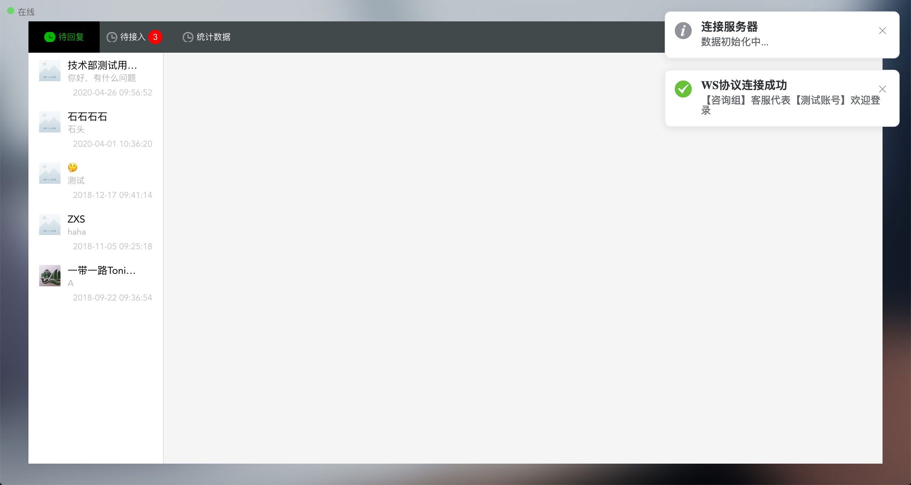
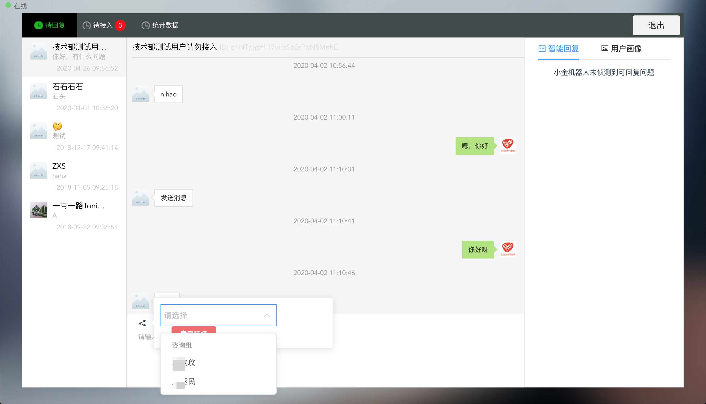
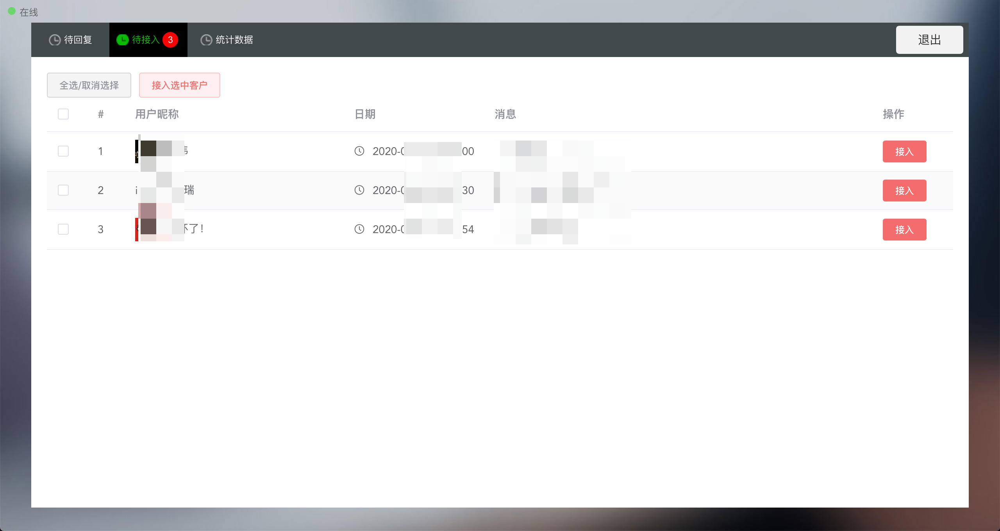
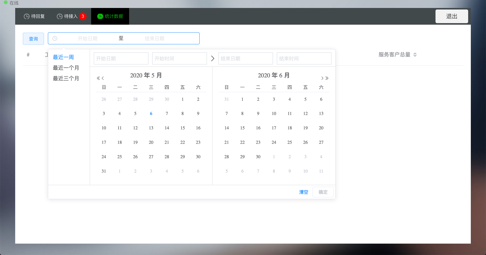
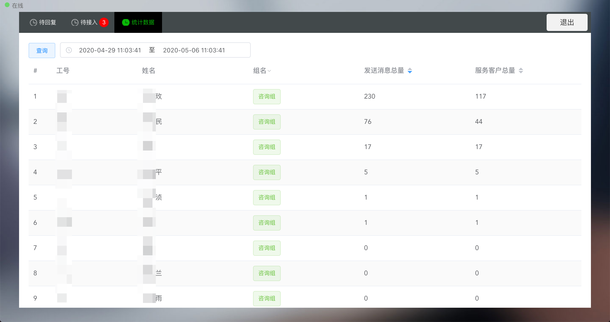

# 在线客服系统

基于Gin、WebSocket、Vue构建的在线客服系统，存储使用MongoDB。

> 用户和客服对话虚拟了一个聊天室，在mongodb中用room文档来维护和存储对话数据，聊天数据也将保留100条，用来隔离用户，在并发下安全

智能机器人回复在另一个基于Python实现的NLP项目中实现，此处通过HTTP调用获得AI自动回复能力 [customerService_NLP](https://github.com/MachineLearning-Team/customerService_NLP)

## 特点
* 支持微信公众号、任意支持WebSocket的终端
* 支持接入用户
* 支持断线重连
* 支持客服转接
* 支持历史消息
* 支持统计消息
* 支持消息已读

## 预览

     
     
     
     
     
    

